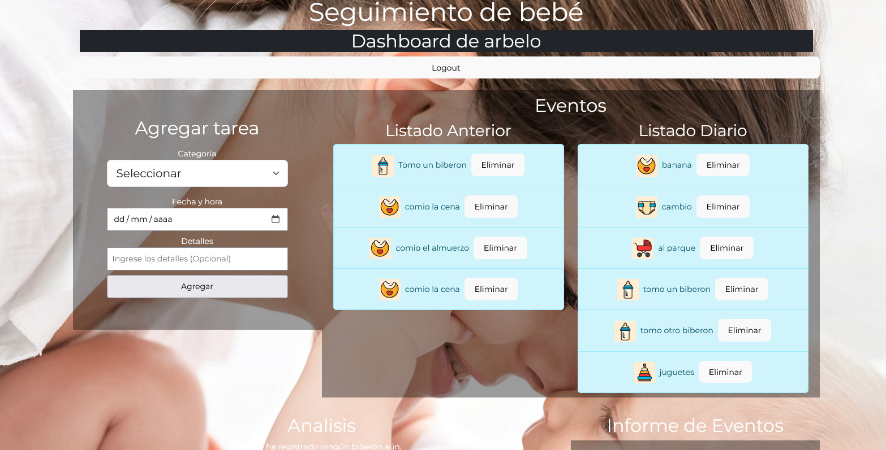

# Proyecto: Dashboard Babysitting

Instrucciones para probar el proyecto:
En la carpeta **Code**:

    Ejecutar npm install.
    Ejecutar npm run build.
    Ejecutar npm run dev.

## Descripción del proyecto:
El objetivo de este proyecto es simplificar el control de las actividades relacionadas con el cuidado de un bebé, ayudando a los padres a registrar de forma automática eventos como comidas, biberones, pañales o juegos, y generando gráficos y métricas en tiempo real. Esto reduce la necesidad de realizar conteos manuales, aliviando su carga de tareas.

El proyecto está desarrollado con **React** y **Redux** y cuenta con distintas funcionalidades

## Autenticación:
 Al ingresar, el usuario es redirigido a una pantalla de inicio de sesión (login), donde también tiene la opción de registrarse. Una vez autenticado, el usuario accede al panel principal (dashboard).
   
   

## Opciones del dashboard:

 -  Agregar eventos: comida, biberón, pañal o juego.
  -  Eliminar cualquier evento con un botón junto al listado correspondiente.
  -  Cerrar sesión (logout).

  

  ## Métricas automatizadas en el menú:
  
 - Listado de eventos del día y anteriores.
 - Gráficos que muestran la cantidad de eventos por categoría.
- Gráfico semanal de comidas ingeridas por día.
- Indicador del tiempo transcurrido desde el último biberón o cambio de pañal.
   
  

