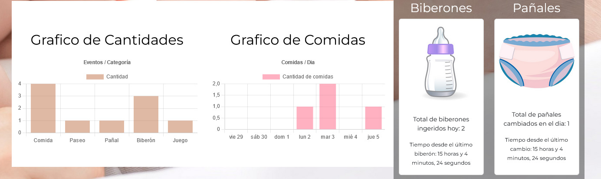

# Project: Dashboard Babysitting
Instructions for testing the project:
In the Code folder:

    Run npm install.
    Run npm run build.
    Run npm run dev.

## Project description:
The goal of this project is to simplify the monitoring of activities related to the care of a baby, helping parents to automatically record events such as meals, bottles, diapers or games, and generating graphs and metrics in real time. This reduces the need for manual counting, relieving their task load.

The project is developed with React and Redux and has several different functionalities:

## Authentication:
 - Upon login, the user is redirected to a login screen, where he/she
   also has the option to register. Once authenticated, the user
   accesses the main panel (dashboard).
   
   

## Dashboard options:

 - Add events: food, bottle, diaper or game. Delete any event with a
   button next to the corresponding listing. Logout.

  

  ## Automated metrics in the dashboard menu: 
  
 - Listing of events of the day and previous events.
 - Charts showing the number of events by category.    
 - Weekly graph of meals eaten per day. 
 - Indicator of the time elapsed since the last bottle or diaper
   change.
   
  

